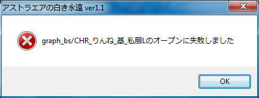

# Loader for Favorite's games: crash fix

This loader attempts to fix definitive crashes if system regional settings are not Japanese. JP locale is still required.

Put `loader.exe` and `payload.dll` into the game's directory, run `loader.exe`. If an error says it cannot find supported executable, try to specify it as the first command line argument for `loader.exe`. Chances are, it will work for some old or newest games. Known games:

* ウィズ アニバーサリィー (Wiz Anniversary)
* 星空のメモリア (Hoshizora no Memoria) -Wish upon a Shooting Star-
* 星空のメモリア (Hoshizora no Memoria) -Eternal Heart-
* いろとりどりのセカイ (Irotoridori no Sekai)
* いろとりどりのヒカリ (Irotoridori no Hikari)
* アストラエアの白き永遠 (AstralAir no Shiroki Towa)
* 紅い瞳に映るセカイ (Akai Hitomi ni Utsuru Sekai)
* アストラエアの白き永遠Finale-白き星の夢- (AstralAir no Shiroki Towa Finale -Shiroki Hoshi no Yume-)
